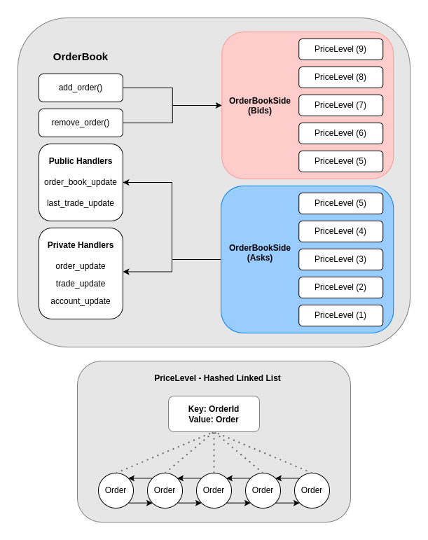

# OrderForge
- OrderForge is a high-performance C++ order matching engine, designed with speed and simplicity in mind.
- [OrderForge is free to use for educational, non-commercial and some small business](https://polyformproject.org/licenses/small-business/1.0.0)

## Benchmark Results
The engine can **insert/remove/match** up to:
- Logging Enabled:  **2.4 million orders/second**.
- Logging Disabled:  **2.7 million orders/second**.

---



## Highlights

### Hashed Linked List
- **Hashed linked list** is an efficient data structure for an exchange matching engine.
- **Operations**:
    - `push_back(insert order)`: O(1)
    - `remove(cancel order)`: O(1)
- This structure combines the simplicity of linked list iteration with the efficiency of O(1) lookup, mapped by `OrderId`.
- Hashed Linked List nodes use a custom pool allocator to avoid costly allocations

### Logging
- The specialized logging system offloads formatting and logging to another thread.
- The main engine thread only needs to copy around **100 bytes** for each order log.
- This setup significantly speeds up the process compared to formatting and logging in the main thread.

### Trade Producer
- The Trade Producer is integral to the order matching process. It receives a crossing order and matches it against passive orders.
- **Tracked Data**:
    - Crossing order
    - Matched passive orders
    - Trades generated
    - Quantity filled

### Scaled Int
- Scaled Int ensures precise handling of small floating-point numbers by scaling up doubles at the point of construction. These scaled values are used consistently throughout the engine, maintaining accuracy in computations.

---

## Getting Started

1. `main.cpp`, where the demo application provides a clear overview of the interface.
2. `order_forge/order_book.h` for insights into the core functionality.
3. `order_forge/trade_producer.h` to understand the order matching logic.
4. `order_forge/book_level.h` to examine the Hashed Linked List, the backbone behind many of the engine's operations.
---

## Running the Demo App

Getting the demo app running is straightforward:

```bash
mkdir build-release && cd build-release
cmake -DCMAKE_BUILD_TYPE=Release ..
make
./demo_run
```

## Cmake

```cmake
include(FetchContent)

FetchContent_Declare(
  order_forge
  GIT_REPOSITORY https://github.com/hamish-mackie/OrderForgeMatchingEngine.git
  GIT_TAG        main  # Replace with a specific tag or branch if needed
)

FetchContent_MakeAvailable(order_forge)

```

## License
https://polyformproject.org/licenses/small-business/1.0.0